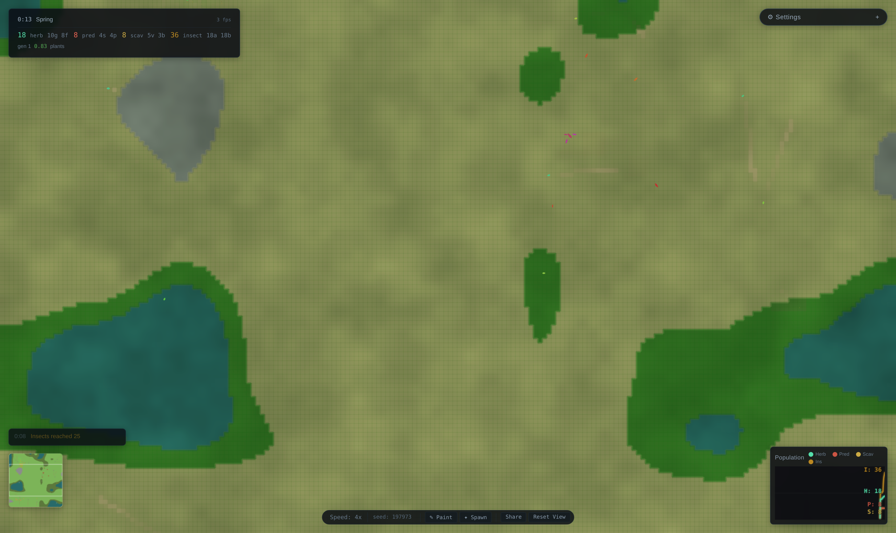

# Ecosystem Simulator

   

A real-time artificial-life simulation that runs entirely in the browser. Creatures live on procedurally generated terrain, hunt for food, reproduce, and pass on heritable traits — so foraging, clustering, and boom-and-bust population cycles emerge on their own instead of being scripted. Built with TypeScript and rendered with PixiJS (WebGL).



> Status: experimental and a work in progress. Fun to watch and tinker with, but behaviors and internals are still changing.

## What it does

- Creatures carry heritable traits that drift over generations through reproduction and selection
- Procedural terrain (grassland, forest, water) shapes where food grows and how creatures move
- Emergent behavior — foraging, clustering, predator/prey population swings — arises from simple per-creature rules, not global scripting
- Real-time PixiJS/WebGL rendering with a pannable, zoomable camera and a live minimap
- Live HUD with per-species counts, generation, and a population graph; spawn and paint tools for tinkering with the world

## Tech

TypeScript, Vite, and PixiJS. The simulation runs in a Web Worker so rendering stays smooth. The source is split into focused modules under `src/`:

- `sim` — the simulation engine: creatures, evolution, terrain, and the update loop
- `render` — PixiJS rendering
- `ui` — on-screen controls and readouts
- `audio` — sound feedback

## Quick start

Requires Node.js 18 or newer.

```bash
git clone https://github.com/HouseofTyrell/EcosystemSimulator.git
cd EcosystemSimulator
npm install
npm run dev
```

Then open the local URL Vite prints (usually http://localhost:5173).

To build and preview a production bundle:

```bash
npm run build
npm run preview
```

## Why I built this

I wanted to see how far simple, local rules could go toward producing lifelike behavior. No global choreography — just creatures reacting to their surroundings, and watching the ecosystem find its own balance or fall out of it.

## License

MIT — see [LICENSE](LICENSE).
